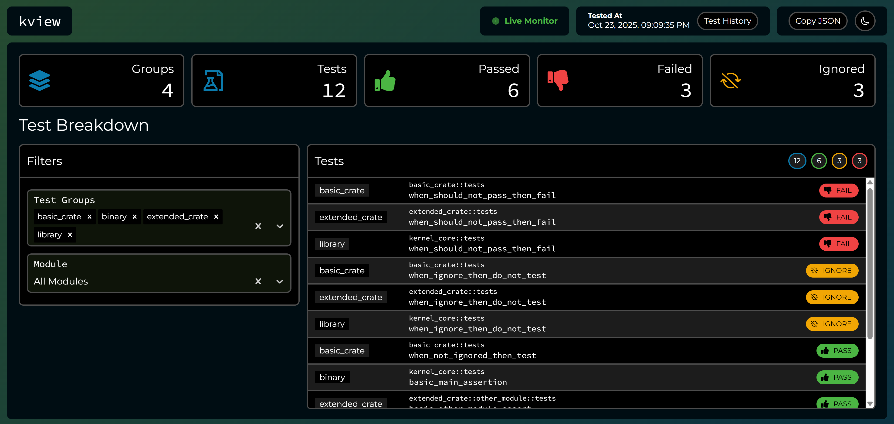
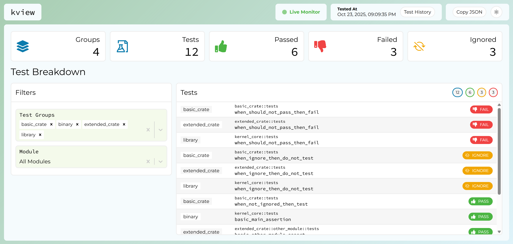

# kview

A simple containerized webapp for viewing kernel test results. If `kboot` is used to build a kernel that uses `ktest` for testing, this webapp can be used for viewing test results.

## Features

- Dashboard for `ktest` test results (pass, fail, ignore)
- Filter search results by test group or module
- Live monitoring for new results - no refresh required
- View full test history, based on the `kboot` .build directory
- Light / dark theme toggle

**Note:** A "test group" is usually a crate, except for the primary kernel crate, which has two test groups: one for the library (lib.rs), and another for the binary (main.rs)

Dark Mode:


Light Mode:


## How to Run

This webapp was designed to be automatically installed and launched by `kboot`. After testing a kernel with `kboot`, this webapp should launch at:

URL: http://localhost:3000

It is also possible to run outside of Docker, but this is only recommended for webapp development purposes. In that case, add a `.env.local` file to the base of the project with the following content:

```
BUILD_DIRECTORY=<path-to-your-kernel-.build-dir>
```

Then run with the following command:

```
npm run dev
```